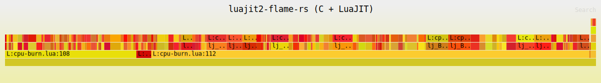

# luajit2-flame-rs

`luajit2-flame-rs` is an eBPF-based CPU flame graph profiler for LuaJIT 2.x. It
profiles a running process by PID, resolves interpreter frames to `source:line`,
attributes active JIT traces to their Lua function, and can combine native C
frames with Lua frames in the same flame graph.

The profiler supports x86_64 and aarch64 Linux. Its user-space component is
written in Rust, while CPU sampling and LuaJIT stack walking run in eBPF.

### Lua-only flame graph


This graph was generated from the bundled `tests/cpu-burn.lua` workload using
the default Lua-only output mode.

### C and Lua flame graph



This graph was generated from the same workload with `--include-c-stacks`, so
native LuaJIT frames are shown together with the Lua source frames.

## Features

- Profiles a running LuaJIT process by PID.
- Captures CPU samples with `perf_event` and eBPF.
- Resolves Lua frames as `L:<chunkname>:<line>`.
- Attributes JIT trace execution as `JIT:<chunkname>:<function-line>`.
- Unwinds native C frames from ELF DWARF CFI without requiring frame pointers.
- Interleaves Lua frames with native C frames for mixed-stack analysis.
- Writes folded stacks and an SVG flame graph.

## Quick start

Before running the profiler, the target machine must provide:

- Linux kernel >= 5.13 with eBPF, uprobes, perf events, and BTF enabled.
- Readable kernel BTF at `/sys/kernel/btf/vmlinux`.
- `kernel.perf_event_paranoid <= 1`.
- A running process with LuaJIT 2.x loaded.
- `root` privileges, or the equivalent eBPF, perf-event, uprobe, and
  process-access permissions required by the host kernel.

Release archives contain statically linked binaries. Running a release binary
does not require Rust, Clang, `libbpf-dev`, or `libelf-dev`.

After extracting the release archive for the target architecture, profile a
LuaJIT process for 10 seconds with:

```sh
# Confirm that perf-event sampling is allowed.
cat /proc/sys/kernel/perf_event_paranoid

# Run this only when the value is greater than 1.
echo 1 | sudo tee /proc/sys/kernel/perf_event_paranoid

# Use ./target/release/luajit2-flame-rs instead when built from source.
sudo ./luajit2-flame-rs -p <PID> -d 10 -o folded.txt
```

The command writes:

- `folded.txt`: folded stack output.
- `folded.svg`: rendered flame graph.

Lua-only output is the default. Add `--include-c-stacks` to include native C
frames, or use `--disable-lua` for native-only profiling:

```sh
sudo ./luajit2-flame-rs -p <PID> --include-c-stacks -d 10 -o mixed.txt
```

Open the generated SVG in a browser to inspect the result.

## Build from source

Source builds require Rust >= 1.77, Clang/LLVM for compiling the eBPF program,
and the native C development toolchain used by `libbpf`.

Install the build dependencies on Debian/Ubuntu with:

```sh
sudo apt install build-essential clang llvm pkg-config \
  autoconf automake autopoint bison flex gawk \
  libelf-dev libbpf-dev zlib1g-dev
```

### x86_64

The checked-in `bpf/vmlinux.h` targets x86_64, so the release binary can be
built directly:

```sh
cargo build --locked --release
```

The resulting binary is `target/release/luajit2-flame-rs`.

### aarch64

Before building on aarch64, install `bpftool` and regenerate `bpf/vmlinux.h`
from the build machine's kernel BTF:

```sh
bpftool btf dump file /sys/kernel/btf/vmlinux format c > bpf/vmlinux.h.tmp
mv bpf/vmlinux.h.tmp bpf/vmlinux.h
cargo build --locked --release
```

`bpftool` is only needed to generate this architecture-specific build input;
the profiler does not invoke it at runtime.

The build script compiles `bpf/profile.bpf.c` with Clang and generates the Rust
libbpf skeleton at compile time through `libbpf-cargo`.

## Architecture

```text
target process (nginx / OpenResty / any LuaJIT embedder)
   │
   │  uprobe on lua_resume / lua_pcall     → capture lua_State* per tid
   │  uretprobe on lua_yield               → drop lua_State* per tid
   │  perf-event CPU clock @ N Hz          → on each sample:
   │      • registers + user stack bytes   → offline native unwind input
   │      • bpf_get_stack()                → fallback native IPs
   │      • walk lua_State                 → bytecode PC → source line
   │
   ▼  perf buffer
┌──────────────────────────────────────────────────────────┐
│ Rust user space                                          │
│   libbpf-rs  : load skeleton, attach uprobe/perf-event   │
│   goblin     : find lua_resume/lua_pcall offsets in ELF  │
│   framehop   : unwind native frames from ELF DWARF CFI   │
│   blazesym   : resolve native IPs → C symbol names       │
│   inferno    : folded stacks → flame graph SVG           │
└──────────────────────────────────────────────────────────┘
```

Native unwinding runs in user space. The eBPF program captures registers and a
bounded user-stack snapshot, then `framehop` applies the target modules' ELF
`.eh_frame` or `.debug_frame` data. If DWARF unwinding cannot recover a usable
stack, that sample falls back to the native IPs collected by `bpf_get_stack()`.

Lua frames do not depend on DWARF. The eBPF stack walker reads LuaJIT runtime
metadata directly to recover Lua source files, lines, and active JIT functions.

## Usage reference

The only required flag is `-p/--pid`:

```sh
sudo ./luajit2-flame-rs -p 1234
```

By default, the profiler samples at 99 Hz, runs until Ctrl-C, emits only Lua
frames, writes folded stacks to `folded.txt`, and writes the flame graph to
`folded.svg`.

Example bounded capture:

```sh
sudo ./luajit2-flame-rs -p 1234 -F 99 -d 10 -o folded.txt
```

| Flag | Description |
|---|---|
| `-p, --pid <PID>` | Target process PID. Required. |
| `-F, --frequency <N>` | Sampling frequency in Hz. Default: `99`. |
| `-d, --duration <S>` | Capture duration in seconds. `0` means until Ctrl-C. Default: `0`. |
| `-U, --user-stacks-only` | Omit kernel frames. |
| `--include-c-stacks` | Include native C frames in addition to Lua frames. |
| `--disable-lua` | Native-only profiling. |
| `-o, --output <FILE>` | Folded output path. The SVG is written next to it. |

## Demo workload

If no LuaJIT process is available to profile, use the bundled test harness. It
mimics the nginx/OpenResty model where each request enters Lua through
`lua_resume`.

```sh
# Build LuaJIT once.
(cd ../luajit2/src && make && make install PREFIX=/usr/local && ldconfig)

# Build the C harness that drives lua_resume.
cc -O2 tests/harness.c -o /tmp/lua-harness \
   -I/usr/local/include/luajit-2.1 \
   -L/usr/local/lib -lluajit-5.1 -lm -ldl -Wl,-rpath=/usr/local/lib

# Start the workload.
/tmp/lua-harness tests/cpu-burn.lua &
HPID=$!

# Profile Lua frames for 8 seconds.
sudo ./target/release/luajit2-flame-rs -p $HPID -d 8 -o folded.txt

# Include native C frames in the same flame graph.
sudo ./target/release/luajit2-flame-rs \
  -p $HPID --include-c-stacks -d 8 -o mixed.txt
```

The demo disables JIT by default for deterministic interpreter line coverage.
Set `LUAJIT2_FLAME_RS_JIT=1` when starting the harness to exercise JIT
profiling.

Lua source lines come from LuaJIT runtime metadata, so LuaJIT does not need to
be built with `-g` for Lua stack collection. Debug symbols are useful only when
more native symbol detail is needed in mixed stacks. Native unwinding uses
`.eh_frame` or `.debug_frame`, which standard Linux toolchains normally emit
even for optimized builds that omit frame pointers.

## Limitations

- The Lua stack walk is bounded by `MAX_LUA_DEPTH` to keep eBPF verifier
  complexity manageable.
- Native DWARF unwinding captures up to 4 KiB from the user stack in bounded
  chunks and is limited to 32 frames. A sample falls back to `bpf_get_stack()`
  when offline unwinding cannot recover a usable stack.
- JIT-generated machine code has no ELF DWARF CFI, so its native portion uses
  the fallback stack. LuaJIT runtime metadata still provides the `JIT:` frame.
- `L:` interpreter frames identify the sampled source line. `JIT:` frames
  identify the materialized Lua function running on a trace; optimized inline
  frames and the exact source line within a trace are not reconstructed.
- GC64 versus non-GC64 is selected at BPF compile time with
  `-DLJ_TARGET_GC64=1` by default for 64-bit OpenResty-style LuaJIT builds.
- Standalone `luajit` usually drives execution through one `lua_pcall`; use the
  bundled harness or a real nginx/OpenResty process for a more realistic
  `lua_resume` workload.
