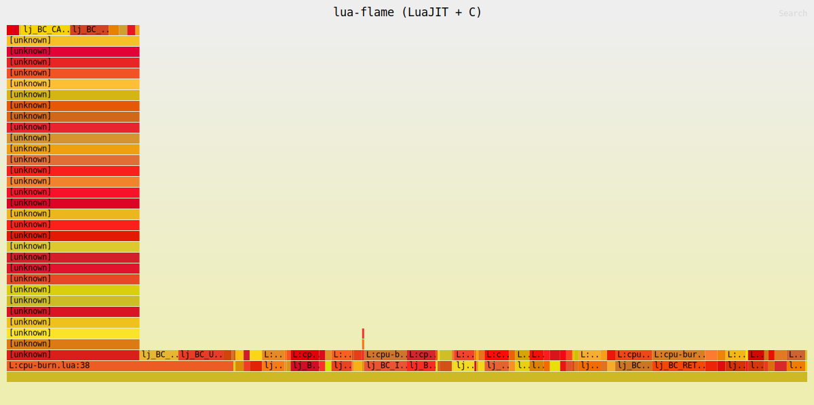

# lua-flame

`lua-flame` is an eBPF-based CPU flame graph profiler for LuaJIT 2.x. It is
written in Rust for user space and C for the eBPF program, and it can resolve
LuaJIT interpreter frames down to `source:line` while preserving native C frames
in mixed stacks.



The image above is a representative Lua-only flame graph generated from the
bundled `tests/cpu-burn.lua` workload.

## Features

- Profiles a running LuaJIT process by PID.
- Captures CPU samples with `perf_event` and eBPF.
- Resolves Lua frames as `L:<chunkname>:<line>`.
- Interleaves Lua frames with native C frames for mixed-stack analysis.
- Writes folded stacks and an SVG flame graph.

## Requirements

`lua-flame` currently targets Linux only.

Runtime requirements:

- Linux kernel >= 5.13 with BTF enabled (`CONFIG_DEBUG_INFO_BTF=y`)
- `root` privileges, or equivalent capabilities for eBPF, uprobes, and perf events
- `kernel.perf_event_paranoid <= 1`
- A running process with LuaJIT loaded
- LuaJIT JIT disabled in the target process:

```lua
jit.off(); jit.flush()
```

Build requirements on Debian/Ubuntu:

```sh
sudo apt install clang libelf-dev libbpf-dev linux-tools-common
```

Rust >= 1.77 is required.

## Quick start

```sh
cargo build --release

# perf_event_paranoid must be <= 1 for sampling.
cat /proc/sys/kernel/perf_event_paranoid

# Run this only if the value is greater than 1.
echo 1 | sudo tee /proc/sys/kernel/perf_event_paranoid

# Profile a running LuaJIT process for 10 seconds.
sudo ./target/release/lua-flame -p <PID> -d 10 -o folded.txt
```

The command writes:

- `folded.txt`: folded stack output
- `folded.svg`: rendered flame graph

Open `folded.svg` in a browser to inspect the result.

## Usage

The only required flag is `-p/--pid`:

```sh
sudo ./target/release/lua-flame -p 1234
```

By default, `lua-flame` samples at 49 Hz, runs until Ctrl-C, writes folded stacks
to `folded.txt`, and writes the flame graph to `folded.svg`.

Example bounded capture:

```sh
sudo ./target/release/lua-flame -p 1234 -F 99 -d 10 -o folded.txt
```

Options:

| Flag | Description |
|---|---|
| `-p, --pid <PID>` | Target process PID. Required. |
| `-F, --frequency <N>` | Sampling frequency in Hz. Default: `49`. |
| `-d, --duration <S>` | Capture duration in seconds. `0` means until Ctrl-C. Default: `0`. |
| `-U, --user-stacks-only` | Omit kernel frames. |
| `--lua-user-stacks-only` | Emit Lua frames only. |
| `--disable-lua` | Native-only profiling. |
| `-o, --output <FILE>` | Folded output path. The `.svg` file is written next to it. |

## Demo workload

If you do not already have a LuaJIT process to profile, use the bundled test
harness. It mimics the nginx/OpenResty model where each request enters Lua via
`lua_resume`.

```sh
# Build LuaJIT once.
(cd ../luajit2/src && make && make install PREFIX=/usr/local && ldconfig)

# Build the C harness that drives lua_resume.
cc -O2 tests/harness.c -o /tmp/lua-harness \
   -I/usr/local/include/luajit-2.1 \
   -L/usr/local/lib -lluajit-5.1 -lm -ldl -Wl,-rpath=/usr/local/lib

# Start the workload.
/tmp/lua-harness tests/cpu-burn.lua &
HPID=$!

# Profile Lua frames for 8 seconds.
sudo ./target/release/lua-flame -p $HPID --lua-user-stacks-only -d 8 -o folded.txt
```

You do not need to build LuaJIT with `-g` for Lua stack frames. Lua source lines
come from LuaJIT runtime metadata, not DWARF debug information. Debug symbols are
only useful when you want more native symbol detail in mixed stacks.

## Architecture

```text
target process (nginx / OpenResty / any LuaJIT embedder)
   │
   │  uprobe on lua_resume / lua_pcall     → capture lua_State* per tid
   │  uretprobe on lua_yield               → drop lua_State* per tid
   │  perf-event CPU clock @ N Hz          → on each sample:
   │      • bpf_get_stack()                → native user-space IPs
   │      • walk lua_State                 → bytecode PC → source line
   │
   ▼  perf buffer
┌──────────────────────────────────────────────────────────┐
│ Rust user space                                          │
│   libbpf-rs  : load skeleton, attach uprobe/perf-event   │
│   goblin     : find lua_resume/lua_pcall offsets in ELF  │
│   blazesym   : resolve native IPs → C symbol names       │
│   inferno    : folded stacks → flame graph SVG           │
└──────────────────────────────────────────────────────────┘
```

The build script compiles `bpf/profile.bpf.c` with `clang` and generates the
Rust libbpf skeleton at compile time via `libbpf-cargo`.

## Limitations

- The Lua stack walk is bounded by `MAX_LUA_DEPTH` to keep eBPF verifier
  complexity manageable.
- `kernel.perf_event_paranoid` must be `<= 1` for sampling.
- GC64 vs non-GC64 is selected at BPF compile time with `-DLJ_TARGET_GC64=1`
  by default for 64-bit OpenResty-style LuaJIT builds.
- Standalone `luajit` usually drives execution through one `lua_pcall`; for a
  more realistic `lua_resume` workload, use the bundled harness or profile a
  real nginx/OpenResty process.
